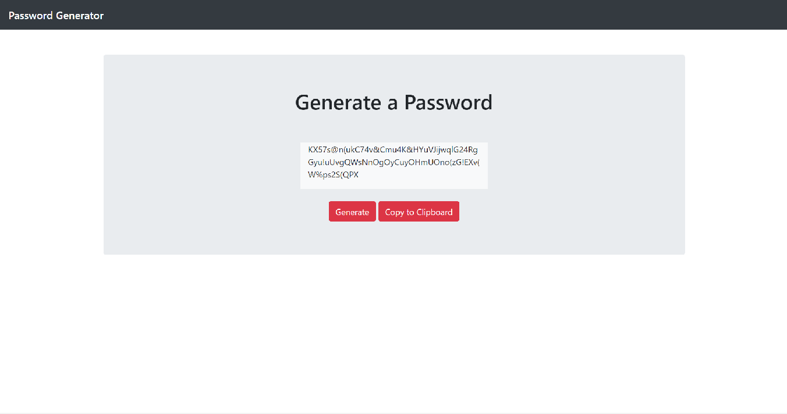
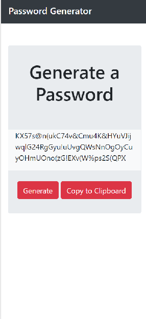

# My Password Generator

## Overview

This project was tough starting out. I learned how to choose a random
character from a string and concatinate it to a new string all of it inside of an
event listener. I could not get the copy to clipboard function to work unfortunately.

## Instructions

click on the "Generate" button below the generate a password text.
Once you click that button a series of prompts will pop up: 
-"do you want to use upper case letters"
-"do you want to use lower case letters"
-"do you want to use numbers"
-"do you want to use special characters"
-"how many characters would you like to use between 8 and 126"
 using ok will decide that you will use that option for your passowrd.
 choosing a number between 8 and 126 is a requirement. 
 Not choosing any of the above character options will result in no password generated.

 The interface is pretty simple

 

 and the mobile version

 

 I had alot of help from my study group to figure out why I could not get the clipboard to work,
 however we couldnt figure it out.
